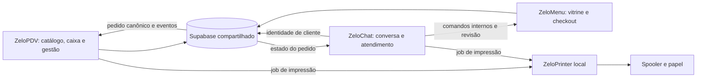

# Integração e fricção operacional — Zelo — 2026-09-04

## Diagnóstico

O ecossistema já possui um núcleo coerente: catálogo/dono no PDV, publicação e checkout no Menu, conversa no Chat, pedidos canônicos no PostgreSQL e spool local no Printer. O maior problema encontrado foi **divergência de contrato e de versão**, com efeitos concretos: CRM não vinculava clientes, timeout podia duplicar impressão e uma rotina de frete falhava no banco.

A prioridade de UX é tornar o resultado de cada ação claro e recuperável. Reduzir etapas não significa esconder incerteza de pagamento, venda ou impressão. Não houve redesenho, troca de componentes ou identidade visual nesta auditoria.

## Mapa dos contratos

| Fronteira | Regra a preservar | Quebra encontrada / proteção |
| --- | --- | --- |
| Conta e empresa | Auth user, owner_user_id e empresaId não são intercambiáveis; service role exige filtro explícito | Cache e fila PDV agora exigem owner conhecido; SDK local de impressão autoriza o dispositivo inteiro, não isola tenants |
| Catálogo PDV→Menu | `id_usuario` do dono; publicação em overlay; `ocultar_no_pdv` só controla frente de caixa | Sem nova flag ou catálogo paralelo; estoque agregado inclui complementos e quantidades |
| Entitlement | `subscriptions`, tier e flags atuais; permissões `pedidos.*` continuam persistidas, mesmo após aposentadoria do add-on homônimo | Editor admin corrigido; cópias de resolvers continuam exigindo comparação entre produtos |
| Menu→pedido | Preço/estoque rematerializados no servidor; `create_zelo_order`; token/revisão não são autorização de canal interno | Context público agora aceita só public_order/table_order; rejeita whatsapp_order no boundary público |
| Chat→Menu | Chave interna, tenant/JID/mensagem/revisão; comando deduplicado; confirmação vinculada à sessão | RPC `confirm_whatsapp_zelo_order_atomic_v1` confirmada live e restrita a service role; docs antigas de aplicação pendente corrigidas |
| CRM Chat→PDV | `ensure_customer_from_whatsapp(owner, phone, observed_name)`; resposta `pessoaId` | Chamava cinco args e lia pessoa_id: PGRST202 observado em produção. Adaptador corrigido, conflito nunca vira vínculo automático |
| Frete | Snapshot/regras JSONB e versão da cotação; configuração deve usar a assinatura live | Função de salvar regras corrigida no banco sem trocar ACL/defaults; CAS da revalidação continua risco no Menu |
| Venda/fiado/estoque | `client_sale_id` estável e transação PostgreSQL; apagar pendente só após data.id | Chave legacy agora persistida antes da RPC e reutilizada entre abas; pendentes sem owner não são atribuídas silenciosamente |
| Pagamento | Meio declarado/QR Pix não é pagamento recebido; venda de mesa pertence ao fechamento da comanda | Não foi criado crédito/débito ou estorno durante testes. Troco e reconciliação precisam de contrato explícito entre checkout e operação |
| Impressão | `jobId`, source, companyStoreId, tipo, conteúdo; uma intenção pode ter resposta incerta | Novo contrato distingue unavailable antes do POST de unknown depois. Dedup limitado no nativo e persistido nos consumidores; segunda via consciente tem id novo |
| Distribuição | SDK embutido, SDK browser e instalador são artefatos separados | `/connect` não existe no nativo auditado; pareamento por código continua necessário. Novo código não está automaticamente publicado |

## Jornadas e redução de fricção

| Jornada | Problema operacional | Estado melhorado / próximo ajuste objetivo |
| --- | --- | --- |
| Entrar no Chat para consultar a conta | Landing/login baixavam painel de atendimento inteiro | AppShell sob lazy/AuthGuard reduz JS inicial em 35,1%, preservando navegação |
| Usar PDV no mesmo navegador com outra conta | Cache anterior podia mostrar itens de outra loja; fila antiga podia seguir com dono errado | Catálogo exige dono e confirmação online negativa não cai em dado antigo. Pendências desconhecidas ficam preservadas; falta recuperação guiada por suporte |
| Montar pedido com complementos | Quantidade de complemento não era somada corretamente ao estoque total | Validação rejeita demanda impossível antes de materializar. Manter mensagem de item indisponível e preservar carrinho |
| Abrir Menu após deploy/configuração | Página raiz podia chegar sem configuração runtime; API inexistente devolvia HTML 200 | HTML passa pelo mesmo injector/no-store; APIs inexistentes devolvem JSON 404. Evita tela que carrega mas não consegue consultar |
| Trocar ou remover foto do produto | Rascunho apagava imagem publicada antes do Salvar; cancelar não restaurava o arquivo | Upload preserva antiga; cleanup só após save confirmado. Falha mantém dados para retry; regressões desktop/mobile verificam remoção cancelada |
| Reconhecer cliente vindo do WhatsApp | Mensagem chegava, mas cadastro/identidade falhava silenciosamente para a operação | Adapter alinhado ao SQL real. Conflitos continuam explícitos e não mesclam pessoas automaticamente |
| Parear PDV e Chat no mesmo PC | Segundo pareamento revogava o primeiro; UI dizia conectado com token morto | Até32 tokens independentes e detect com validação. Um controle local permite revogar navegadores; não se pede senha nova por produto |
| Imprimir pedido com rede local instável | Após timeout, usuário podia receber outra via sem perceber que a primeira já saiu | Texto orienta conferir papel; fallback/retry automáticos suspensos em resultado incerto. Botão de segunda via continua ação consciente |
| Imprimir em dispositivo que sumiu | Agente escolhia outra impressora/padrão/PDF silenciosamente | Seleção explícita agora falha claramente. Diagnóstico deve indicar o dispositivo salvo e a ação para reconectar |
| Fechar venda offline | Reinício após resposta perdida podia gerar nova intenção; cache vazio ressuscitava itens removidos | Id estável persistido, confirmação necessária antes de apagar, vazio autoritativo. Ainda é contingência, não gestão inteira offline |
| Cadastrar conta | PostHog mostra INP elevado em amostra pequena; código espera analytics/referral antes de navegar | Priorizar trace e desacoplamento de analytics da conclusão, com teste que mantenha atribuição e não duplique evento. Não confundir fetch assíncrono com causa comprovada do INP |
| Confirmar pedido com cupom | Reserva e criação do pedido não compartilham transação; falha pode deixar estado inconclusivo | Pendente: atomicidade ou reconciliação por sessão. UX deve recuperar mesmo pedido/cupom em retry, sem exigir remontagem |

Não adicionar um wizard novo de integração. O diagnóstico deve caber nas ações existentes: aplicação local aberta, navegador autorizado, impressora selecionada, resultado enviado/incerto. Para pedidos, o mesmo número/ID deve continuar visível na conversa, cardápio, painel e cupom. Os IDs técnicos adicionais ficam em detalhes de suporte/logs, não no fluxo diário.

## Consistência, retries e falhas externas

1. **Banco:** transação/idempotency key define o efeito único; frontends devem manter a mesma intenção após timeout. Novo UUID em todo retry não é idempotência.
2. **Webhooks/filas:** aceitar repetição, registrar origem/ID e fazer claim com lease; não confundir HTTP200 com efeito concluído. Polling adaptativo de Chat já estava em produção.
3. **Printer:** spool aceito não comprova papel; após restart a dedup volátil se perde. Resultado incerto não pode ser transformado em erro “aplicativo fechado”.
4. **Storage:** objeto e referência no banco não formam uma transação. A imagem anterior deve sobreviver até o save confirmado; timeout não autoriza apagar automaticamente o upload novo.
5. **Pagamentos:** cobrança criada, pagamento confirmado e entitlement ativo são estados distintos. Criar retry cego quando provedor pode ter aceitado gera cobranças duplicadas.
6. **Deploy:** aplicar SQL incompatível antes/depois do consumidor errado quebra vários produtos. Priorizar alterações aditivas e teste de contrato entre assinatura live e adapter.

## Compatibilidade de versões e publicação

Chat foi atualizado com fast-forward da cópia atrasada em 47 commits para `e6c7ca4`, equivalente à base observada no Dokploy. Patches novos continuam locais. Menu diverge: um commit local e 40 remotos; não foi reescrita a alteração local. O relatório Menu identifica arquivos em colisão e correção de estoque já existente upstream. **Não publicar o diff inteiro dessa cópia sem reconciliar versões.** PDV estava alinhado no fetch; Printer permanece versão 0.1.2 local, sem release novo.

O teste mínimo de compatibilidade deve cruzar cliente antigo/agente novo, cliente novo/agente antigo, token revogado, timeout antes/depois do POST, segunda via e falta de impressora. Entre serviços: owner/subusuário, mudança de preço/estoque após abrir carrinho, revisão concorrente, cupom, confirmação repetida e status após reinício. Isso pede staging/fixtures compartilhadas, sem um novo framework de arquitetura.

## Observabilidade ponta a ponta e prioridades

| Ordem | Ação | Critério de aceite |
| --- | --- | --- |
| 1 | Publicar de forma coordenada as correções locais depois da reconciliação Menu e gates | Mesma assinatura SQL, mesmo pedido recuperado após resposta perdida, nenhum grant ampliado |
| 2 | Exercitar venda/checkout/impressão com falhas em ambiente descartável e térmica | Sem segunda baixa/fiado/pedido; resultado incerto explícito e segunda via deliberada |
| 3 | Tornar cupom/confirm/revalidação seguros sob retry/CAS | Duas abas não sobrescrevem silenciosamente; cupom não é consumido sem pedido recuperável |
| 4 | Padronizar correlação em logs existentes | requestId + empresa/owner pseudonimizado + orderId/client_sale_id + jobId + fase/duração/resultado; sem token, conteúdo ou telefone |
| 5 | Medir UX de cadastro e primeiro uso | Tempo conta→primeira venda, motivo de abandono/erro e INP por interação com amostra conhecida |
| 6 | Rebrand | Corrigir escala visual, bordas e densidade depois; não redesenhar antes de estabilizar os contratos |

Limites: não houve compra/cobrança, mensagem enviada a cliente, pedido real, sessão de suporte alterada ou impressão física. O navegador do usuário foi usado para consultar Dokploy e PostHog; configurações e campanhas permaneceram sem alterações.
